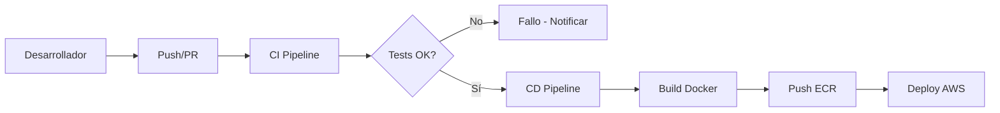

# CI/CD - GitHub Actions

## Problema de negocio

En el contexto de **DataOps**, la automatización de pipelines de datos presenta desafíos únicos que van más allá del desarrollo de software tradicional. Los equipos de datos necesitan garantizar no solo la calidad del código, sino también la **calidad de los datos** que fluyen a través del sistema.

### Desafíos específicos de DataOps

A diferencia del desarrollo de software, donde los tests unitarios validan la lógica del código, en ingeniería de datos enfrentamos:

- **Datos variables**: los datos cambian constantemente, a diferencia del código que es estático
- **Dependencias externas**: sistemas transaccionales, APIs, archivos que pueden fallar o cambiar
- **Calidad de datos**: valores nulos, duplicados, formatos incorrectos, datos obsoletos
- **Volúmenes masivos**: procesamiento de millones de registros que requieren validación eficiente
- **Impacto en negocio**: datos incorrectos pueden generar decisiones erróneas costosas

### Tests unitarios en datos

Los **tests unitarios de datos** validan transformaciones y reglas de negocio con conjuntos de datos controlados:

- **Tests de transformación**: validan cálculos como segmentación RFM con datos de entrada conocidos
- **Tests de calidad**: verifican reglas de negocio (emails válidos, montos positivos, etc.)
- **Tests de integridad**: validan relaciones entre tablas y consistencia referencial
- **Detección temprana**: errores se identifican antes de llegar a producción

### Calidad de código vs. Calidad de datos

- **Calidad de código**: sintaxis correcta, lógica válida, estándares, performance, mantenibilidad
- **Calidad de datos**: integridad, precisión, frescura, validez, completitud
- **Integración**: ambos tipos de validación se ejecutan en el pipeline de CI/CD

Este módulo resuelve el problema de **automatización de DataOps** al implementar pipelines de CI/CD que garantizan tanto la calidad del código como la calidad de los datos, desplegando automáticamente los cambios a AWS.

## Arquitectura de CI/CD

### Pipelines implementados

#### 1. **CI Ingesta** (`ci-ingesta.yml`)
- **Trigger**: pull requests y pushes a main que afecten archivos de `ingesta/`
- **Funciones**:
  - Instalación de dependencias Python
  - **Tests de calidad de código**: linting, validación de sintaxis, formateo
  - **Tests de calidad de datos**: validación de esquemas, integridad, reglas de negocio
  - **Tests unitarios de datos**: validación de transformaciones con datos de prueba
  - Construcción de imagen Docker (sin push)

#### 2. **CI Transformación** (`ci-transformacion.yml`)
- **Trigger**: pull requests y pushes a main que afecten archivos de `transformacion/`
- **Funciones**:
  - Instalación de dependencias dbt
  - **Validación de modelos SQL**: sintaxis, referencias, dependencias
  - **Tests de dbt**: tests de integridad, unicidad, not null, relaciones
  - **Tests de reglas de negocio**: validaciones específicas del dominio
  - Verificación de documentación y lineage

#### 3. **CD Ingesta** (`cd-ingesta.yml`)
- **Trigger**: push a main que afecten archivos de `ingesta/`
- **Funciones**:
  - Construcción de imagen Docker
  - Push a Amazon ECR
  - Actualización de definición de tarea ECS
  - Despliegue automático a Fargate
  - **Validación post-despliegue**: verificación de que el pipeline funciona correctamente

### Flujo de trabajo

## Características técnicas

### Seguridad
- **Permisos mínimos**: cada workflow solo tiene los permisos necesarios
- **Secrets encriptados**: todas las credenciales se almacenan como secrets de GitHub
- **Validación de código**: tests automáticos antes de cualquier despliegue

### Eficiencia
- **Triggers específicos**: workflows solo se ejecutan cuando cambian archivos relevantes
- **Caché de dependencias**: reutilización de dependencias entre ejecuciones
- **Paralelización**: ejecución simultánea de tests cuando es posible

### Monitoreo
- **Notificaciones**: fallos se reportan automáticamente
- **Logs detallados**: cada paso del pipeline se registra
- **Estados visibles**: estado de cada workflow visible en la interfaz de GitHub

## Buenas prácticas implementadas

### Separación de responsabilidades
- **CI separado de CD**: pruebas independientes del despliegue
- **Workflows modulares**: cada módulo tiene su propio pipeline
- **Triggers específicos**: solo se ejecuta lo necesario

### Manejo de errores
- **Fail fast**: el pipeline se detiene en el primer error
- **Notificaciones claras**: mensajes de error descriptivos
- **Rollback automático**: en caso de fallo en despliegue

### Escalabilidad
- **Reutilización de código**: workflows reutilizables entre módulos
- **Configuración centralizada**: secrets y variables en un lugar
- **Fácil mantenimiento**: estructura clara y documentada
