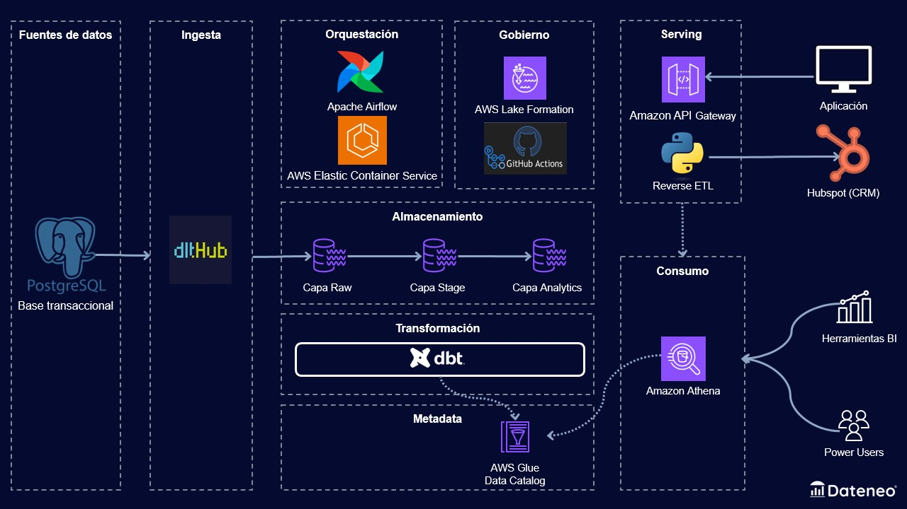

# DataVision - Plataforma de contenido interactivo

## Sobre este proyecto

Este repositorio forma parte de la **Especialización en Ingeniería de Datos** de [Dateneo](https://link.dateneo.com/web).
Durante el programa trabajamos con un caso realista y construimos un proyecto completo en AWS, aplicando ingesta, modelado, orquestación, gobierno y serving de datos.

La especialización incluye:

* Formación práctica con clases semanales en vivo.
* Acceso a un entorno en AWS para experimentar con herramientas reales.
* Proyecto final aplicable a tu portfolio profesional.

Conocé más en [dateneo.com](https://link.dateneo.com/web).

## Sobre DataVision

DataVision es la empresa ficticia sobre la que trabajamos en toda la especialización. Es una plataforma en línea que ofrece la posibilidad de crear contenido interactivo en diversos formatos, como artículos, líneas de tiempo, cuestionarios y proyectos prácticos. Los usuarios se registran con cuentas gratuitas o de pago (suscripciones Premium o Empresarial), lo que determina el acceso y la cantidad de contenidos que pueden generar mensualmente.

### Modelo de negocio

- **Suscripciones freemium**: con planes gratuitos, Premium y Empresarial.
- **Contenido interactivo**: diversificado (artículos, líneas de tiempo, cuestionarios, proyectos).
- **Límites por plan**: que determinan la cantidad de contenido generable mensualmente.
- **Experiencia personalizada**: basada en el tipo de usuario y sus interacciones.
- **Campañas de marketing**: dirigidas para conversión y retención.

### Necesidad analítica

DataVision necesita transformar los datos operacionales en insights accionables para:

- **Segmentar usuarios**: según su comportamiento (RFM) para estrategias de retención y conversión.
- **Predecir churn**: y diseñar intervenciones proactivas para usuarios Premium/Empresarial.
- **Optimizar recomendaciones**: de contenido interactivo para aumentar engagement.
- **Automatizar campañas**: de marketing basadas en segmentación y límites de uso.
- **Monitorear métricas**: de negocio en tiempo real (conversiones, uso de contenido, retención).

## Arquitectura del proyecto

Este proyecto implementa una **arquitectura lakehouse de tres capas** que procesa datos desde sistemas transaccionales hasta insights de negocio:

```
┌─────────────────┐    ┌─────────────────┐    ┌─────────────────┐
│   Raw Layer     │    │  Staging Layer  │    │ Analytics Layer │
│   (S3 Raw)      │───▶│   (S3 Staging)  │───▶│  (S3 Analytics) │
│                 │    │                 │    │                 │
│ • Datos crudos  │    │ • Datos limpios │    │ • Tablas dims   │
│ • Sin estructura│    │ • Normalizados  │    │ • Tablas facts  │
│ • Histórico     │    │ • Validados     │    │ • Métricas RFM  │
└─────────────────┘    └─────────────────┘    └─────────────────┘
```

## Módulos del proyecto

### 🔄 [Ingesta](ingesta/README.md)
**Problema**: capturar datos de múltiples fuentes (sistemas transaccionales, APIs, logs) de forma confiable y escalable.

**Solución**: pipeline ELT usando dltHub que extrae, normaliza y carga datos al lakehouse, con validaciones de calidad integradas.

**Tecnologías**: Python, dltHub, AWS Athena, S3, DuckDB, Docker.

### 🔄 [Transformación](transformacion/README.md)
**Problema**: convertir datos crudos en modelos dimensionales para análisis de negocio.

**Solución**: modelo dimensional implementado con dbt que construye tablas de dimensiones y hechos, incluyendo segmentación RFM y análisis de churn.

**Tecnologías**: dbt, SQL, AWS Athena, S3, Docker.

### 🔄 [Orquestación](orquestacion/README.md)
**Problema**: coordinar la ejecución de pipelines complejos con dependencias, manejo de errores y monitoreo.

**Solución**: orquestación con Apache Airflow que ejecuta contenedores Docker en AWS Fargate, con retry automático y alertas.

**Tecnologías**: Apache Airflow, AWS ECS Fargate, ECR, CloudWatch.

### 🔄 [Calidad de datos](calidad_de_datos/README.md)
**Problema**: garantizar la confiabilidad de los datos desde la ingesta hasta el consumo.

**Solución**: tests automatizados con Soda Core que validan integridad, completitud y reglas de negocio.

**Tecnologías**: Soda Core, SodaCL, Python, integración con dbt.

### 🔄 [Consumo y Serving](consumo_y_serving/README.md)
**Problema**: exponer datos analíticos a equipos de negocio y sistemas operativos.

**Solución**: API REST para consultas en tiempo real y reverse ETL para sincronización con CRM.

**Tecnologías**: FastAPI, AWS Lambda, API Gateway, HubSpot API.

### 🔄 [Nivelación](nivelacion/README.md)
**Problema**: repasar conceptos fundamentales de Python y SQL antes de implementar arquitecturas complejas.

**Solución**: ETL básico que automatiza reportes de Excel usando solo Python y SQL.

**Tecnologías**: Python, SQL, pandas, openpyxl.

### 🔄 [CI/CD](.github/workflows/README.md)
**Problema**: automatizar pruebas, builds y despliegues para mantener la calidad y confiabilidad del código.

**Solución**: pipelines de GitHub Actions que ejecutan tests, construyen imágenes Docker y despliegan automáticamente a AWS.

**Tecnologías**: GitHub Actions, Docker, AWS ECR, ECS Fargate.

## Flujo de datos end-to-end

1. **Ingesta**: datos de sistemas transaccionales se extraen y cargan en S3 (raw layer)
2. **Transformación**: datos se limpian, normalizan y modelan dimensionalmente (staging + analytics layers)
3. **Calidad**: tests automatizados validan integridad y reglas de negocio
4. **Orquestación**: pipelines se ejecutan de forma programada con monitoreo
5. **Consumo**: datos se exponen via API para dashboards y se sincronizan con CRM

## Arquitectura técnica



## Tecnologías principales

- **Cloud**: AWS (S3, Athena, Lambda, ECS Fargate, ECR, API Gateway)
- **Orquestación**: Apache Airflow
- **Transformación**: dbt (Data Build Tool)
- **Ingesta**: dltHub, Python
- **Calidad**: Soda Core
- **API**: FastAPI, Mangum
- **Contenedores**: Docker
- **Monitoreo**: CloudWatch, Airflow UI

## Estructura del repositorio

```
especializacion-ingenieria-de-datos/
├── ingesta/                    # Módulo de ingesta de datos
├── transformacion/             # Módulo de transformación con dbt
├── orquestacion/              # Módulo de orquestación con Airflow
├── calidad_de_datos/          # Módulo de calidad de datos
├── consumo_y_serving/         # Módulo de consumo (API + Reverse ETL)
├── nivelacion/                # Módulo de nivelación (ETL básico)
├── .github/workflows/         # Pipelines de CI/CD con GitHub Actions
```

## Casos de uso implementados

### Análisis RFM
- **Segmentación de usuarios**: basada en recency, frequency y monetary value.
- **Identificación de usuarios**: en riesgo de churn (especialmente Premium/Empresarial).
- **Estrategias de retención**: personalizadas según el plan de suscripción.

### Automatización de marketing
- **Sincronización de segmentos RFM**: con HubSpot CRM.

### API de datos
- **Consultas en tiempo real**: de segmentación de usuarios
